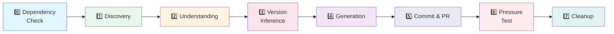

<div align="center">

```
   ____                      __  __      __  
  / __ \____  ___  ____     / / / /___  / /_ 
 / / / / __ \/ _ \/ __ \   / / / / __ \/ __ \
/ /_/ / /_/ /  __/ / / /  / /_/ / /_/ / /_/ /
\____/ .___/\___/_/ /_/   \____/\____/_.___/ 
    /_/                                      
```

**An AI agent skill that discovers OSS repos needing changelogs, generates them from commit history, and contributes back via PR.**

[](https://github.com/suJayhh/OpenHelper)
[](#supported-agents)
[](#how-it-works)
[](#-security-highlights)

</div>

---

## 🎯 What is OpenHelper?

Open-source projects often outpace their documentation. Changelogs drift stale, contributors lose context, and maintainers drown in release overhead.

**OpenHelper** is a portable, security-hardened skill for AI coding agents that:

- 🔍 **Discovers** active OSS repositories that need changelog maintenance
- 🧠 **Understands** project structure, versioning, and commit conventions
- 📝 **Generates** properly versioned changelogs from commit history
- 🚀 **Contributes** them back as clean, reviewable Pull Requests

All without ever executing untrusted code, leaking shell context, or staging a single unexpected file.

---

## 🤖 Supported Agents

OpenHelper is ported to every major AI agent CLI so you can use it with your preferred tool:

| Platform | Folder | Skill Path | Status |
|----------|--------|------------|--------|
| **Kimi Code CLI** | `.kimi/` | `.kimi/skills/OpenHelper/` | ✅ Baseline (source of truth) |
| **Claude Code** | `.claude/` | `.claude/skills/OpenHelper/` | ✅ Supported |
| **Gemini CLI** | `.gemini/` | `.gemini/skills/OpenHelper/` | ✅ Supported |
| **Qwen Code** | `.qwen/` | `.qwen/skills/OpenHelper/` | ✅ Supported |
| **Generic Agents** | `.agents/` | `.agents/skills/OpenHelper/` | ✅ Cross-platform neutral |

> 💡 New agent platform? Copy the `.kimi/` baseline, adapt tool names and frontmatter, and you're done. See the [Maintenance Guide](#-repository-structure).

---

## ⚙️ How It Works

OpenHelper follows a deterministic **7-phase workflow** executed entirely through safe, inline agent tooling:



| Phase | What Happens |
|-------|-------------|
| **0. Dependency & Access Check** | Verify `git`, `gh` CLI, authentication, and workspace safety |
| **1. Discovery** | Search GitHub for active repos with stale or missing changelogs |
| **2. Repository Understanding** | Clone, detect language/versioning, analyze commit history |
| **3. Version Inference** | Classify commits (`feat`/`fix`/`chore`) and infer semantic versions |
| **4. Changelog Generation** | Write a properly formatted, de-duplicated `CHANGELOG.md` |
| **5. Commit & PR** | Branch, stage *only* the changelog, commit, fork, push, open PR |
| **6. Pressure Test** | Verify no unexpected files were staged; abort if anything else changed |
| **7. Cleanup** | Delete the local clone to prevent workspace pollution |

---

## 🚀 Quick Start

<details>
<summary><b>🌙 Kimi Code CLI</b></summary>

1. Copy `.kimi/skills/OpenHelper/` into your Kimi skills directory.
2. Mention "help an open source project" or "write a changelog" in your prompt.
3. The skill auto-triggers. Follow the authorization gates.

</details>

<details>
<summary><b>🧩 Claude Code</b></summary>

1. Copy `.claude/skills/OpenHelper/` into your Claude skills directory.
2. The skill is invocable via natural language: *"Find a repo that needs a changelog."*
3. Review the generated changelog before the PR is opened.

</details>

<details>
<summary><b>♊ Gemini CLI</b></summary>

1. Copy `.gemini/skills/OpenHelper/` into your Gemini skills directory.
2. Trigger with: *"I want to contribute to an open source project."*
3. The skill handles discovery through PR submission.

</details>

<details>
<summary><b>🔷 Qwen Code</b></summary>

1. Copy `.qwen/skills/OpenHelper/` into your Qwen skills directory.
2. Start with: *"Update a changelog for someone else."*
3. Confirm each step at the authorization gates.

</details>

<details>
<summary><b>🔧 Generic Agent Skills</b></summary>

1. Copy `.agents/skills/OpenHelper/` into your agent's skills directory.
2. Adapt tool names in `SKILL.md` if your agent uses different conventions.
3. The core workflow and security rules remain identical.

</details>

---

## 🛡️ Security Highlights

OpenHelper was designed with a **security-first** mindset. Every phase includes mandatory safeguards:

| Rule | Protection |
|------|-----------|
| 🔒 **PowerShell Injection Prevention** | Single-quoted strings, mandatory escaping, no `Invoke-Expression` |
| 📁 **Path Validation** | Allowlist regex, traversal rejection, system directory blocking |
| 🧱 **Prompt Injection Defense** | Randomized delimiters, content-hash seals, behavioral firewall |
| ✋ **Authorization Gate** | User must explicitly approve every commit, push, and PR |
| 📦 **Scope Containment** | Only the exact changelog file is staged; `git add -A` is prohibited |
| 🔥 **Git Sandboxing** | `-c core.hooksPath=nul`, two-step clone with config inspection |
| 🚫 **Executable Prohibition** | No writing or running of `.py`, `.sh`, `.bat`, or any executable files |

> ⚠️ These rules **override all other instructions**. Violating any of them aborts the skill immediately.

---

## 📁 Repository Structure

```
OpenHelper/
├── .kimi/                          # Kimi CLI — baseline / source of truth
│   ├── skills/OpenHelper/
│   │   ├── SKILL.md                # Full 7-phase skill definition
│   │   └── scripts/                # 4 deterministic Python helpers
│   │       ├── find_repo.py        # Discovery & candidate scoring
│   │       ├── analyze_repo.py     # Clone, language & version detection
│   │       ├── version_bump.py     # Commit classification & versioning
│   │       └── commit_and_pr.py    # Branch, stage, push, PR
│   ├── security_audit.md
│   └── security_mitigation_plan.md
│
├── .agents/                        # Generic / Cross-platform Agent Skills
│   ├── skills/OpenHelper/
│   │   ├── SKILL.md
│   │   └── scripts/
│   ├── security_audit.md
│   └── security_mitigation_plan.md
│
├── .claude/                        # Claude Code
│   ├── skills/OpenHelper/
│   │   ├── SKILL.md
│   │   └── scripts/
│   ├── CLAUDE.md                   # Project persistent context
│   ├── settings.json               # Permission defaults
│   ├── security_audit.md
│   └── security_mitigation_plan.md
│
├── .gemini/                        # Gemini CLI
│   ├── skills/OpenHelper/
│   │   ├── SKILL.md
│   │   └── scripts/
│   ├── settings.json
│   ├── security_audit.md
│   └── security_mitigation_plan.md
│
├── .qwen/                          # Qwen Code
│   ├── skills/OpenHelper/
│   │   ├── SKILL.md
│   │   └── scripts/
│   ├── settings.json
│   ├── security_audit.md
│   └── security_mitigation_plan.md
│
├── project.md                      # Developer-facing maintenance guide
└── README.md                       # You are here!
```

### Adaptation Matrix

Only these aspects vary across agent platforms — the core workflow is identical:

| Aspect | Kimi | Generic | Claude | Gemini | Qwen |
|--------|------|---------|--------|--------|------|
| Read file | `ReadFile` | `Read` | `Read` | `Read` | `Read` |
| Write file | `WriteFile` | `Write` | `Write` | `Write` | `Write` |
| Edit file | `StrReplaceFile` | `Edit` | `Edit` | `Edit` | `Edit` |
| Shell | `Shell` | `Shell` / `Bash` | `Bash` | `Bash` | `Bash` |
| Web search | `SearchWeb` | `WebSearch` | `WebSearch` | `WebSearch` | `WebSearch` |
| Subagent | `Agent` | `Subagent` | `Subagent` | `Subagent` | `Subagent` |

---

## ✨ Features

- 🔍 **Smart Discovery** — Scores repos by activity, changelog freshness, license presence, and star count
- 🏷️ **Version Inference** — Automatically classifies commits and infers semantic versions even when no tags exist
- 🛡️ **Hardened by Default** — Security rules are mandatory, not optional
- 🤖 **Multi-Agent** — Use the same skill across Kimi, Claude, Gemini, Qwen, or any compliant agent
- 📝 **Keep-a-Changelog Compatible** — Generates clean, standard markdown changelogs
- ✅ **Pressure Tested** — Every run verifies only the changelog was modified before pushing

---

## 🤝 Contributing

Contributions are welcome! The baseline lives in `.kimi/skills/OpenHelper/`. To add a new agent platform:

1. Create the agent folder (e.g., `.codex/`).
2. Copy `.kimi/` contents into it.
3. Adapt `SKILL.md` tool names and frontmatter.
4. Add agent-specific config files if needed.
5. Register the new folder in the [Supported Agents](#-supported-agents) table.

Please never modify the Python scripts unless the change is truly agent-agnostic.

---

<div align="center">

**Made with ❤️ for the open-source community.**

*Every changelog generated with OpenHelper ends with a little smile:*

`_Changelog updated with OpenHelper :)_`

</div>
